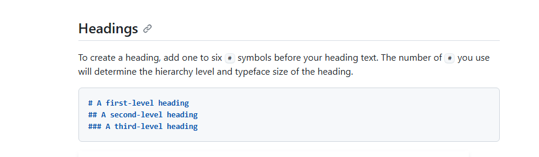

# Project title

Short description of your project

## Table of contents
* [Overview](#overview)
* [Architecture](#architecture)
* [Topic number 3](#topicnumber3)
* [Prerequisites](#prerequisites)
* [Installation](#installation)
* [Usage](#usage)

## Overview
What is your project about?.


## Architecture


<h2 id=topicnumber3> Topic number 3 </h2>

This is a table

|Column1 |  Column2 | Column3  |
|--------|----------|----------|
|Data 1  | Data 2   | Data 3   | 


## Prerequisites
- OpenAI API key

## Installation
1. **Clone the Repository**
   ```bash
   git clone https://github.vodafone.com/VFDE-VNO-Digital/poc_vno_ran_genai_agent
   ```

2. **Install Dependencies**
   ```bash
   pip install -r requirements.txt
   ```
3. **Environment Setup**
   
    Create a `.env` file with the following credentials:
   ```
   OPENAI_API_KEY=your_openai_key
   ```
## Usage
**Start the Application**
   ```python
   streamlit run main_homepage.py
   ```